# pyRogue
> ## **pyRogue** is a `educational` project. Not longer updated.

> ### This project was alive before they released any ToC, Usage Policy's and such. Since they set down some policys, this project is no longer maintained or updated. Hence, the codebase may or may not work.
> ### You accessing the API with this codebase is against they're usage policy's and ToS. Please read them thoroughly.

  


![Release Version][Badge Release Version]  ![Release Date][Badge Release Date] ![Docstring Coverage][Badge Docstring Coverage] ![Downloads][Badge Downloads]

![Badge Last Commit][Badge Last Commit] ![Badge Security Policy][Badge Security Policy] ![Badge Open Issues][Badge Open Issues] ![Badge Open Pull Requests][Badge Open Pull Requests] ![Badge Contributors][Badge Contributors]


---


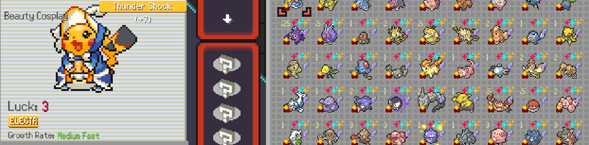
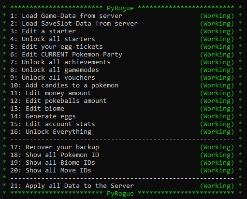

[All Previews](PREVIEW.md)

# Table of Contents
- [Important Foreword](#important-foreword)
- [FAQ](#faq)
- [How to Run the Project](#how-to-run-the-project)
  - [Prerequisites](#prerequisites)
  - [Downloading the Source Code](#downloading-the-source-code)
    - [Option 1: Download and Extract](#option-1-download-and-extract)
    - [Option 2: Clone the Repository](#option-2-clone-the-repository)
  - [Running the Project](#running-the-project)
    - [Windows](#windows)
    - [Linux](#linux)
    - [macOS](#macos)
- [License](#license)
- [Reversed Stuff](#reversed-stuff)
- [Regarding Bans and Limited Accounts](#regarding-bans-and-limited-accounts)

# Important foreword

We learned enough about freezing python to binarys so from here on out it will be source code only.

We will not sent you any files or contact you about anything. You can see who contributed and everything regarding us will be only done on GitHub. We will not contact you in any matter or will send you files. There are scammers out there. Here you can read the full source code, compile it from scratch and such or download a VT-checked official release.

Attention: When ever this tool detects you are trying to manipulate a daily seeded run it will abort. We only do this for educating us and provide the source code opensource in compliance with PokeRogue's License.

- We take no responsibility for your actions when using this tool.  Whenever you startup tho a backup is created and stand: 03.07.2024 - they are applicable no matter created when.

- [Security Notice](TRANSPARENCY.md)

# FAQ

- How do i revert my changes?
  - The programm will always create backups everytime you login! When you load the first time it will create a `base_gameData(trainerID)_03.07.2024_18.03.22.json` unique based on your trainerID coupled with a timestamp. This applies for slot' data aswell; `backup_slotData(slotNumber_trainerID)_03.07.2024_18.03.22.json`. All subsequent backups will be prefixed with `backup_` and you can restore to any file back in time.

  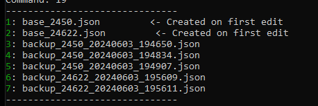

- Will this get me banned?
  - See [Regarding Bans and Limited Accounts](https://github.com/RogueEdit/onlineRogueEditor?tab=readme-ov-file#regarding-bans-and-limited-accounts)

- Where can i donate?
  - We will not accept any money or any form of payment. If you want to help then only by contributing. We do it for education only, any critique welcome.

---

# How to run from code
### Prerequisites
- **Python**: Ensure that Python 3 is installed on your system. You can download it from [python.org](https://www.python.org/downloads/).

## Downloading the Source Code
You can either download the source code as a ZIP file and extract it, or clone the repository using Git.

### Option 1: Download and Extract
1. Download the ZIP file containing the source code.
2. Extract the contents to your desired location.

### Option 2: Clone the Repository
1. Open a terminal or command prompt.
2. Use the following command to clone the repository, including submodules:
   ```bash
   git clone --recursive https://github.com/RogueEdit/pyRogue

---

## Running the Project

> Some Enviroments use `python3` (Microsoft Store) and some need to write `py` only.

### Windows
1. **Navigate to the Source Directory**:
   - Open a terminal (Command Prompt or PowerShell).
   - Navigate to the source directory:
     ```bash
     cd [extracted_folder]/src/
     ```
2. **Install Dependencies**:
   - Use `pip` to install the required packages:
     ```bash
     python -m pip install -r requirements.txt
     ```
3. **Run the Application**:
   - Run the main script:
     ```bash
     python main.py
     ```

---

### Linux
1. **Navigate to the Source Directory**:
   - Open a terminal.
   - Navigate to the source directory:
     ```bash
     cd [extracted_folder]/src/
     ```
2. **Make the Main Script Executable**:
   - Use the following command to ensure the script is executable:
     ```bash
     chmod +x main.py
     ```
3. **Install Dependencies**:
   - Use `pip` to install the required packages:
     ```bash
     python3 -m pip install -r requirements.txt
     ```
4. **Run the Application**:
   - Execute the main script:
     ```bash
     ./main.py
     ```

---

### macOS
The steps for macOS are generally similar to those for Linux:

1. **Navigate to the Source Directory**:
   - Open Terminal.
   - Navigate to the source directory:
     ```bash
     cd [extracted_folder]/src/
     ```
2. **Make the Main Script Executable**:
   - Ensure the script is executable:
     ```bash
     chmod +x main.py
     ```
3. **Install Dependencies**:
   - Use `pip` to install the required packages:
     ```bash
     python3 -m pip install -r requirements.txt
     ```
4. **Run the Application**:
   - Execute the main script:
     ```bash
     ./main.py
     ```

---

# License

- [Based on the Source Code of pokerogue.net](https://github.com/pagefaultgames/pokerogue)
> In compliance with Pokerogue's License this project here is also released under AGPL3.

No copyright or trademark infringement is intended in using Pokémon related names and IDs.
Pokémon © 2002-2024 Pokémon. © 1995-2024 Nintendo/Creatures Inc./GAME FREAK inc. TM, ® and Pokémon character names are trademarks of Nintendo.
 
---

# Reversed Stuff
- Extensive logging for easy debug in a log file

---
- When logging in it will automatically create backups for you.
  - You can restore backups easily see preview above
---
- Change selected slot
  - This will fetch the chosen new slot_x.json containing your session save data
---
- Edit a starter - This will ask you to take any input:

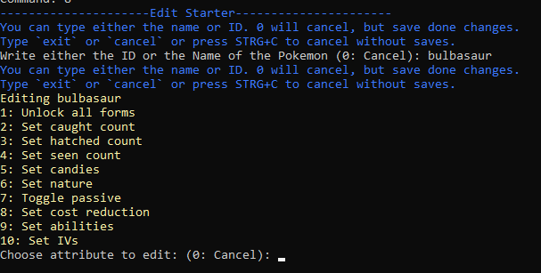

---
- Unlock all starters | same as above but for all pokemons
  - This will unlock every single Pokemon depending on your choosings like above

  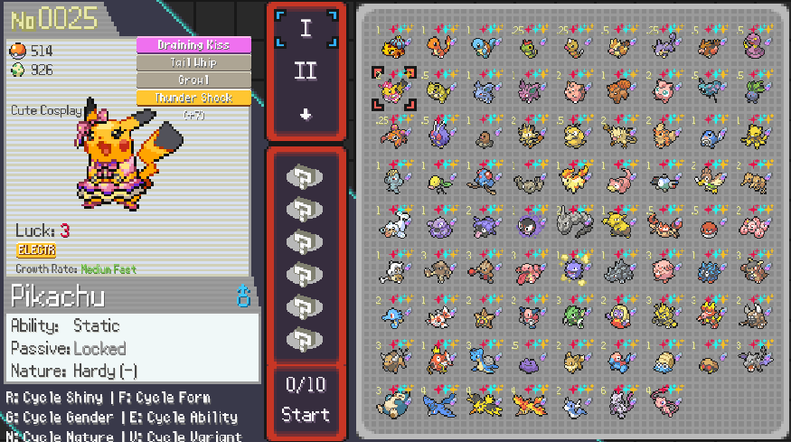
---
- Modify the number of egg-tickets you have
  - This allows you to set the amount of egg gacha tickets you have of every tier

  
---
- Edit a pokemon in your party
  - Let's you edit g-max, fusions, moves, species, level, luck, fusion etc...

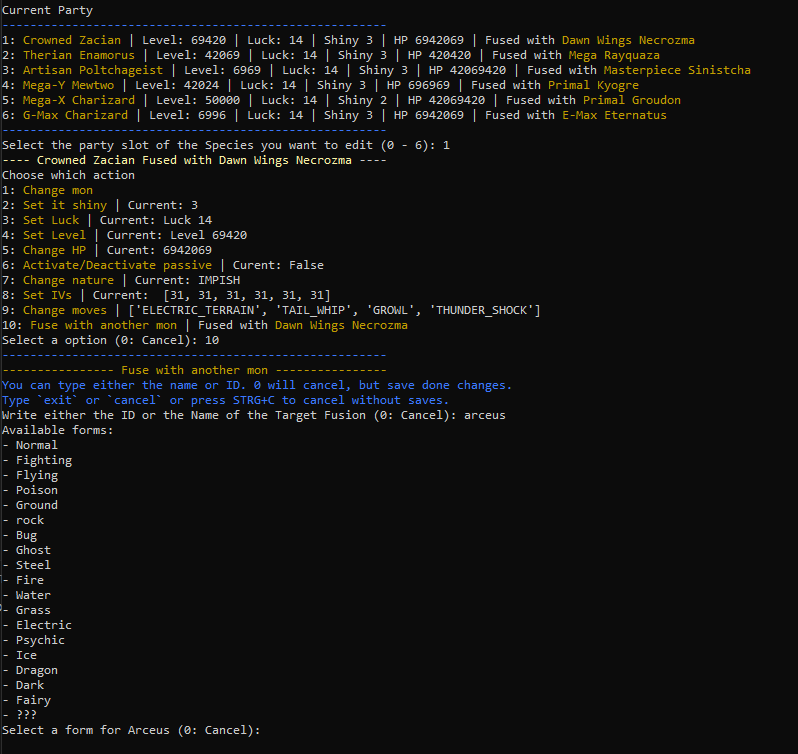

---
- Item Editor

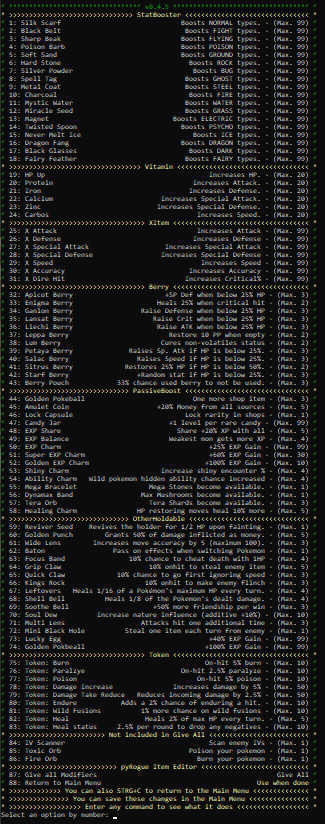

---
- Unlock all game modes
  - Unlocks: classic, endless, spliced endless

- Add one or unlock all
  - Vouchers

  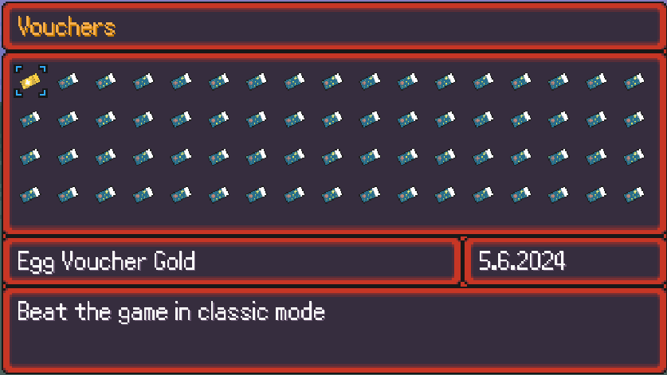

  - Achievements

  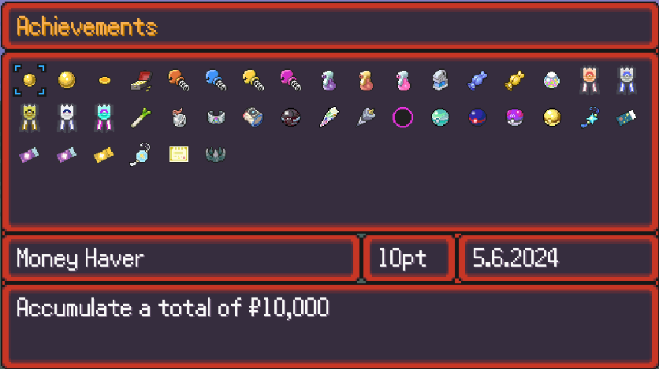

  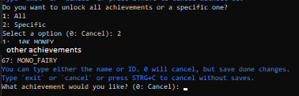

---
- Edit amount of money
  - 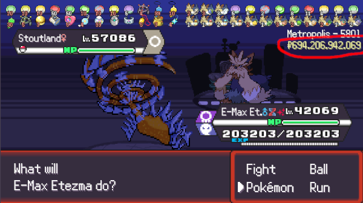
- Edit pokeballs amount
  - 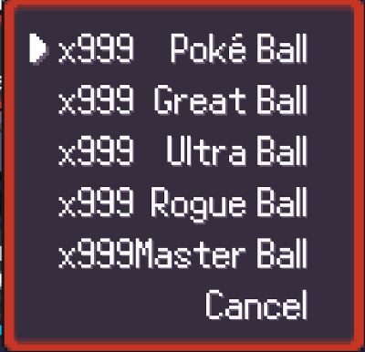
- Edit biome
- Edit candies on a pokemon
---
- Generate eggs
  - Depending on your liking, whatever rarity - gacha type and such

  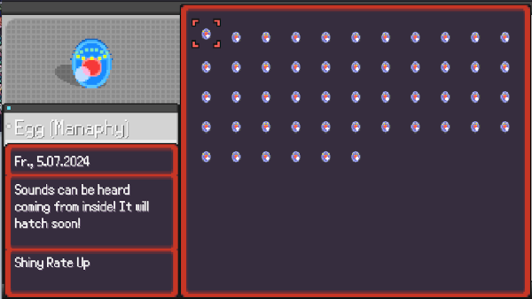

- Set your eggs to hatch
- Edit account stats
  
  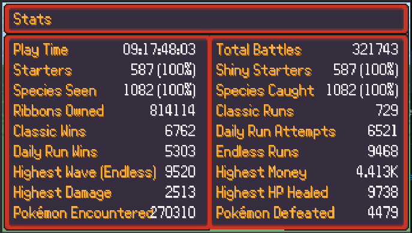
  - Randomize all
  - Set all in a loop
  - Set specific ones

  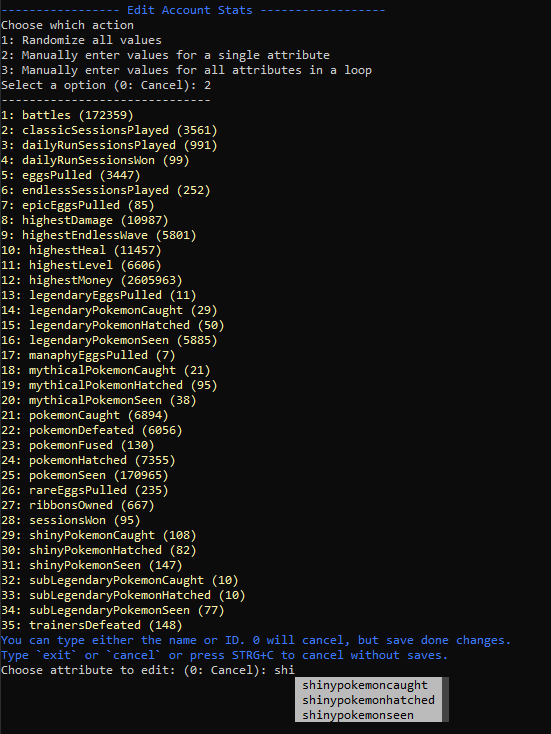
---
- Unlock everything
  - Just calls mulitiple features from above
  - Will also edit account stats with "legit" constraints. Based on your seen variables and such and randomized between reasonable values.
---
- Display all Pokemon with their names and id
- Display all Biomes IDs
- Display all Moves IDs
- Display all Voucher IDs
- Display all Natures
- Display all Nature Slot IDs
- Save data to server via open accesible API calls

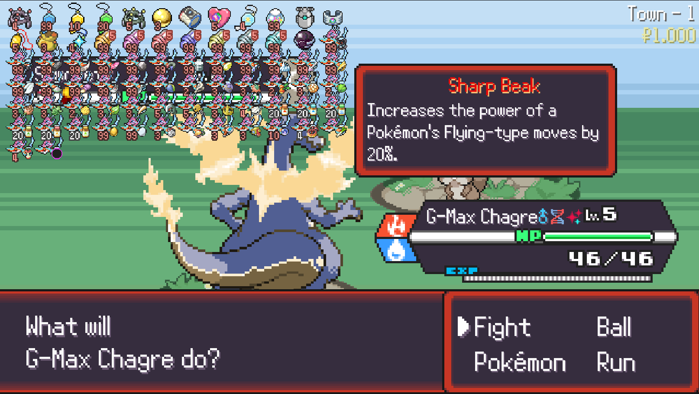

# Regarding Bans and Limited Accounts
https://www.reddit.com/r/pokerogue/comments/1d8hncf/cheats_and_exploits_post_followup_bannable/

https://www.reddit.com/r/pokerogue/comments/1d8ldlw/a_cheating_and_account_deletionwipe_followup/

<meta name="keywords" content="pokerogue, pokerogue save editor, pokerogue, rogueEditor, free, gacha, ticket, tickets, egg, eggs, shiny, save, edit, pokemon, unlimited, trainer, table, pokedex, dex, wave, money, level, levels, iv, ivs, stat, stats, item, items, api, mod, tool, tools, education, python">

<!-- Define URL aliases for badges -->
[Badge Stars]: https://img.shields.io/github/stars/rogueEdit/pyRogue?style=social
[Badge Watchers]: https://img.shields.io/github/watchers/rogueEdit/pyRogue?style=social
[Badge Forks]: https://img.shields.io/github/forks/rogueEdit/pyRogue?style=social

[Badge CodeQL]: https://img.shields.io/github/actions/workflow/status/rogueEdit/pyRogue/codeql.yml?branch=main&label=CodeQL&logo=github&logoColor=white&style=for-the-badge
[Badge Ruff]: https://img.shields.io/github/actions/workflow/status/rogueEdit/pyRogue/codeql.yml?branch=main&label=Ruff%20Lint&logo=ruff&logoColor=white&style=for-the-badge

[Badge Release Version]: https://img.shields.io/github/v/release/rogueEdit/pyRogue?style=for-the-badge&logo=empty
[Badge Release Date]: https://img.shields.io/github/release-date/rogueEdit/pyRogue?style=for-the-badge&logo=empty
[Badge Code Size]: https://img.shields.io/github/languages/code-size/rogueEdit/pyRogue?style=for-the-badge&logo=empty

[Badge Last Commit]: https://img.shields.io/github/last-commit/rogueEdit/pyRogue?style=for-the-badge&logo=empty
[Badge Security Policy]: https://img.shields.io/badge/Security-Policy-red.svg?style=for-the-badge&logo=empty
[Badge Open Issues]: https://img.shields.io/github/issues-raw/rogueEdit/pyRogue?style=for-the-badge&logo=empty
[Badge Open Pull Requests]: https://img.shields.io/github/issues-pr-raw/rogueEdit/pyRogue?style=for-the-badge&logo=empty
[Badge Contributors]: https://img.shields.io/github/contributors/rogueEdit/pyRogue?style=for-the-badge&logo=empty
[Badge Docstring Coverage]: https://img.shields.io/badge/docstr%20coverage-90%25-blue?style=for-the-badge&logo=empty

[Badge Downloads]: https://img.shields.io/github/downloads/rogueEdit/pyRogue/total?style=for-the-badge&logo=empty
[Badge License]: https://img.shields.io/github/license/rogueEdit/pyRogue?style=for-the-badge&logo=empty

<!-- Aliases for Files -->
[MD Security]: ./SECURITY.md
