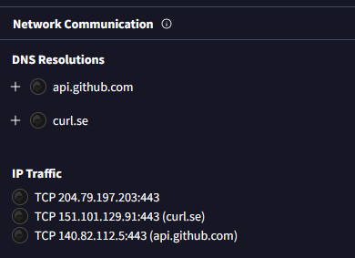

# Security Policy

## Supported Versions

| Version                | Supported          |
| ---------------------- | ------------------ |
| v0.4.8                 | :white_check_mark: |
| v0.4.8                 | :white_check_mark: |
| lesser than v0.4.7-h   | :x:                |

## We request in the web with a trusted Certificate
- What calls to the internet do we do?
  - We call to:
    - `Starting new HTTPS connection (1): api.pokerogue.net:443`
      - and its endpoints for example
      - https://api.pokerogue.net:443 "POST /account/login HTTP/11" 200 None
    - CURL's hosted SSL certificate
      - https://curl.se/docs/caextract.html
    - Our GitHub repo
      - https://api.github.com:443 "GET /repositories/807308129/commits?since=[UTF DATE] HTTP/1.1" 200 2

      
---
##  WE DO NOT SAVE ANYTHING and do NOT send any analytics, nothing
  - Only thing we "save" locally is game related and specifically tool related:
    - `trainer.json`
    - any `slot_*.json`
    - any `backups/*.json`
  - The username and password are volatile and are deleted from memory and never stored once logged in
    - They are solely used to log in
